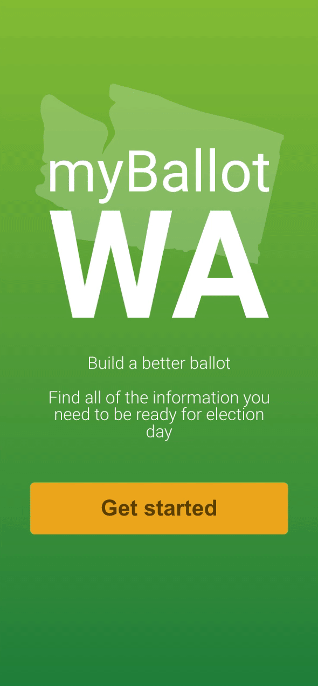
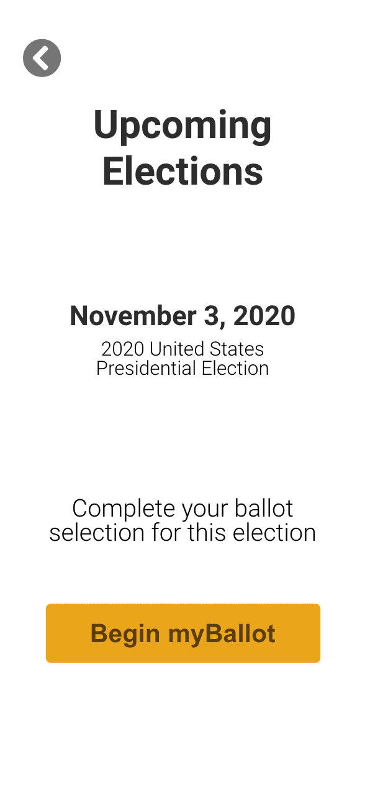

<<<<<<< HEAD
# myBallot-WA

## Mobile ballot builder created to simplify and streamline the voting process for all voters.

myBallot WA is an application that will allow users to input their address to easily locate their voting district. Users can select elections that are open to them to vote in. They will be able to select from all elected positions and referendums that will be available to vote on during the open election. Users can view each candidate running for every position. At first, they can view the candidate's photo, party affiliation, and stances on top issues, they will have the option to 'see more' to view the candidate's biography, education history, and more.

## U/X Design Team Members

- DaiJea Fuller
    - [LinkedIn](www.linkedin.com/in/daijeafuller), [Portfolio](https://www.daijeadesigns.com/)
- Kat Pham
    - [LinkedIn](https://www.linkedin.com/in/katmpham/), [Portfolio](www.katmpham.com)
- Shani Millar-Vaughn
    - [LinkedIn](www.linkedin.com/in/shaniio), [Portfolio](https://www.shani.io/)

## Software Engineering Team Members

- Eric Bondoc
    - [LinkedIn](https://www.linkedin.com/in/eric-bondoc), [GitHub](https://github.com/eb46), [Portfolio](https://www.eric-bondoc.com/) 
- Leah Mattern
    - [LinkedIn](https://www.linkedin.com/in/lady-leah-mattern/), [GitHub](https://github.com/Lady-Mattern), [Portfolio](www.ladyleahmattern.com)
- Travis Tincher
    - [LinkedIn](https://www.linkedin.com/in/travis-tincher/), [GitHub](https://github.com/trtincher), [Portfolio](http://travis-tincher-portfolio.surge.sh/)
- Zhijie (Jenny) Xu
    - [LinkedIn](https://www.linkedin.com/in/jennyzhijiexu/), [GitHub](https://github.com/ZGZOO), [Portfolio](https://jennyxuportfolio.netlify.app/)

## Prototype

## Preview

    <h3>Onboarding</h3>
     
    <h3>Ballot Builder</h3>
    

## Technologies
<h5>
Languages: JavaScript, HTML, CSS, Sass (SCSS)
</h5>
<h5>
Libraries: Axios, React Router, React PDF Print
</h5>
<h5>
Frameworks: ReactJS
</h5>
<h5>
Tools: GitHub, Trello, Figma, Netlify
</h5>

## Features in-progress
- User can filter ballot items based on address entered in onboarding form.
- User can print or email final ballot page.
- Ballot items displaying complete data (photos, bio summary, etc).
=======
# myBallot
Personalized Ballot Builder mobile web application for voters in Washington state.

## Live Link
https://myballot.netlify.app/

## Contributors
* Developers
  * Eric Bondoc
  * Travis Tincher
  * Leah Mattern
  * Zhijie (Jenny) Xu
* UX/UI Designers
  * DaiJea Fuller
  * Shani Millar-Vaughn
  * Kat Pham
>>>>>>> 594a61f2add13531f4757a46573d8226e3af8a30
